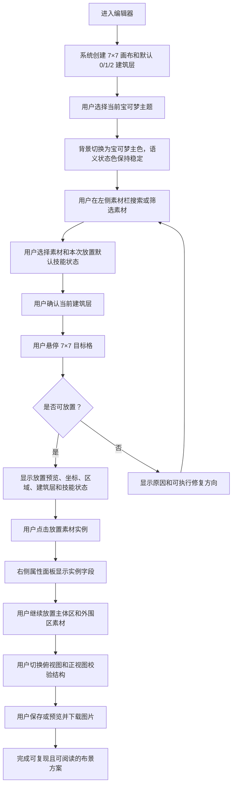
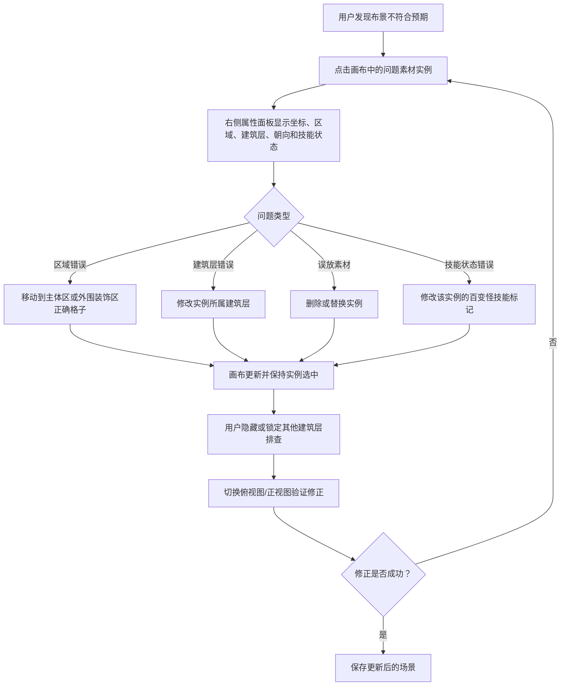
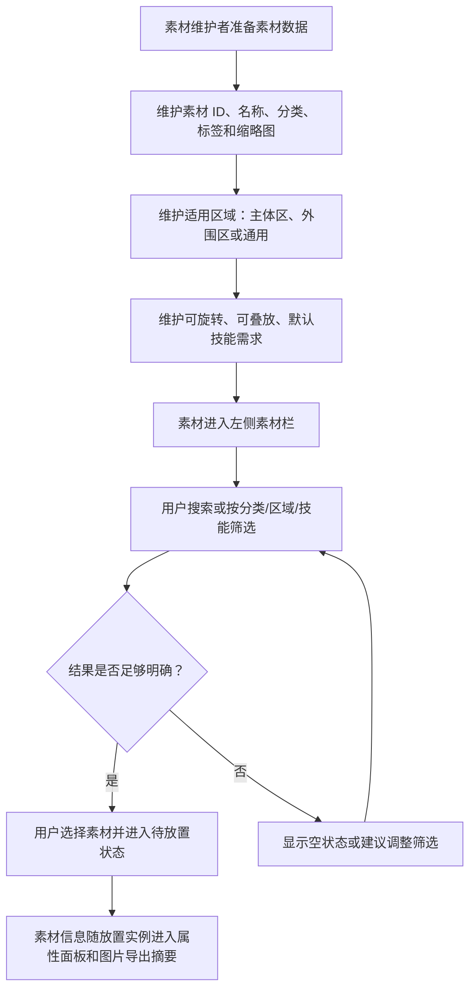
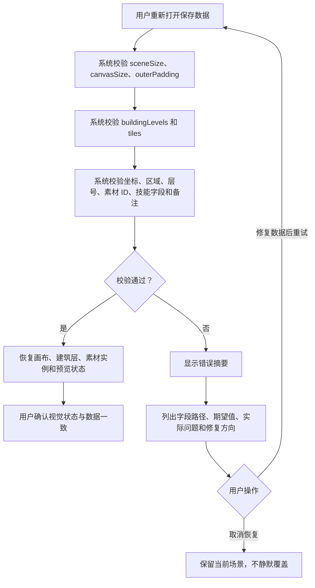

---
stepsCompleted:
  - 1
  - 2
  - 3
  - 4
  - 5
  - 6
  - 7
  - 8
  - 9
  - 10
  - 11
  - 12
  - 13
  - 14
lastStep: 14
inputDocuments:
  - _bmad-output/planning-artifacts/prd.md
  - _bmad-output/archive/2026-05-27/planning-artifacts/supporting-documents/prd-validation-report.md
  - docs/需求文档.md
---

# UX Design Specification pokopia-scene-editor

**Author:** Grigri
**Date:** 2026-05-15

---

<!-- UX design content will be appended sequentially through collaborative workflow steps -->

## Executive Summary

### Project Vision

pokopia-scene-editor 是一个面向 Pokopia 布景创作者的结构化 5×5 布景编辑器。产品用 7×7 实际编辑画布表达中心 5×5 主体区和外围一圈装饰区，让用户可以在同一数据模型中完成素材摆放、真实 footprint 占用、建筑层管理、百变怪技能标记、俯视图/正视图预览，以及保存和导出。

### Approved Course Correction - 2026-05-19

本 UX 规格已按 `_bmad-output/archive/2026-05-27/planning-artifacts/sprint-change-proposals/sprint-change-proposal-2026-05-19.md` 收敛 MVP。任何旧段落中关于建筑层隐藏/锁定、手动保存、dirty/saved/saveError、撤销/重做、素材空状态恢复动作、素材适用区域阻断校验、素材堆叠、实例移动、普通实例备注、素材可旋转差异、预览网格/主体边界/技能标记开关，以及 Mobile 下键盘查看操作的要求均被本节覆盖。

更新后的 MVP 交互原则：

- 建筑层只保留创建、删除、重命名、复制和切换；不显示隐藏/锁定状态。
- 预览固定不显示网格、主体边界和技能标记，也不提供对应开关。
- 工作台不提供手动保存、撤销或重做入口；自动保存和恢复是数据可信闭环。
- 素材空状态只展示空状态文本，不提供清除筛选、显示全部或切换分类等恢复动作。
- 所有素材均可旋转；不展示“是否可旋转”差异。
- 选中实例不提供移动入口或普通备注字段；技能备注保留。
- Mobile View-only Mode 下所有应用级键盘操作 no-op；桌面/平板键盘快捷操作不再作为 MVP 强制要求。

### Approved Course Correction - 2026-05-22

本 UX 规格已按 `_bmad-output/archive/2026-05-27/planning-artifacts/sprint-change-proposals/sprint-change-proposal-2026-05-22.md` 增加图片导出预览和图片导出。当前导出入口不再指 JSON 文件导出；它应打开一张即将下载的布景说明图片预览，图片必须包含整体使用素材、逐层图形和逐层素材清单。

导出预览和下载不得修改当前场景、不得触发 autosave、不得写入 saved storage 或 UI preferences。导入、JSON 文件导出/导入、分享链接、云同步、账号、公开方案库和在线发布仍为 Post-MVP 或 out of scope。

### Approved Course Correction - 2026-05-25

本 UX 规格已按 `_bmad-output/archive/2026-05-27/planning-artifacts/sprint-change-proposals/sprint-change-proposal-2026-05-25.md` 增加 Worker、MCP 和 Codex skill 的 developer/agent workflow。当前终端用户工作台不新增 API console、登录、云保存、分享链接或服务端图片生成入口；现有图片导出预览和下载仍是浏览器内体验。

仓库结构将按 pnpm workspace monorepo 调整：现有 React 浏览器 UI 归入 `apps/web/src/`，只把可脱离 DOM/React/localStorage 的领域规则抽取到 `packages/scene-core/`；`apps/worker/` 和 Codex skill 只提供工具化调用面。任何 agent-facing 输出必须服务布景校验、恢复、素材查询和导出摘要等具体任务，而不是把底层 API 噪音暴露给用户。

### Approved Course Correction - 2026-05-27

本 UX 规格已按 `_bmad-output/archive/2026-05-27/planning-artifacts/sprint-change-proposals/sprint-change-proposal-2026-05-27.md` 增加真实素材 footprint 与跨层占用规则。终端用户工作台必须把大素材显示为跨格实例，而不是在每个格子重复显示；90/270 度旋转后，放置预览和已放置素材都要交换 length/width 方向。height 大于 1 的素材会让上方建筑层对应格子显示为不可放置，但这些不可放置状态是 `scene-core` 派生结果，不是用户可编辑或可保存字段。

本次 UX 不新增 SceneDocument v2、footprint 编辑器或高级遮挡控制。素材维护者通过 catalog metadata 维护 footprint；创作者只在素材详情、放置预览、不可放置提示、预览和图片导出中看到该规则的结果。

### Target Users

目标用户包括 Pokopia 布景创作者和素材库维护者。布景创作者需要把灵感或搭建方案整理成可复现、可继续编辑、可分享的数据；素材库维护者需要维护素材名称、分类、标签、适用区域、技能需求、footprint、缩略图和筛选信息，让创作者能快速找到正确素材。

### Key Design Challenges

- 必须让用户始终理解“对外 5×5”和“实际编辑 7×7”的关系，避免外围装饰区被误认为主体区或被忽略。
- 必须在有限空间中同时呈现素材选择、画布、建筑层、属性和预览状态，避免编辑工具变成分散的多页面流程。
- 必须让大素材的跨格 footprint、旋转后占用方向和 height 上层阻塞清楚可见，避免用户以为素材仍是单格对象。
- 建筑层、当前编辑层、技能标记和选中格状态必须清楚可见，不能只依赖颜色；MVP 不提供建筑层锁定或隐藏状态。
- 俯视图和正视图需要足够直观，但 MVP 不应陷入复杂真实视角或遮挡模拟。

### Design Opportunities

- 通过稳定的三栏/多区域编辑布局，把素材、画布、属性和建筑层组织成高效的创作工作台。
- 通过主体区边界、外围区样式、footprint 跨格预览、上层阻塞状态、技能角标、层级状态和预览切换，让 Pokopia 的布景规则自然可见。
- 通过 Open Design 原型流程生成更贴近真实工具界面的设计方向，而不是输出营销页式 UI。
- 通过清晰的数据恢复、错误提示和图片导出结构，让用户信任方案可以被复现并被他人阅读。

## Core User Experience

### Defining Experience

核心体验是：用户在规则始终可见的 7×7 多建筑层画布中，通过搜索和筛选选择素材，在当前建筑层放置一个带真实 footprint 的素材实例，为该实例标记百变怪技能，并通过即时画布反馈、结构预览、可信恢复状态和图片导出预览，持续确认这个布景可以被保存、恢复并导出为可阅读图片。

该编辑器不是通用绘图工具。每次放置都必须明确绑定到一个具体实例：素材 ID、anchor x/y 坐标、主体区或外围装饰区、建筑层、朝向、footprint 占用格和百变怪技能标记。用户应始终知道自己正在编辑的是哪个建筑层、哪个格子、哪个素材实例，以及这个实例实际占用了哪些格子。

### Platform Strategy

MVP 采用桌面优先 Web App。主要交互面向鼠标/指针，支持高频搜索、筛选、悬停预览、点击放置、实例选中、属性编辑、建筑层切换和预览切换。键盘快捷操作可以保留，但不作为 MVP 强制验收要求。

移动端不作为完整编辑主场景，但窄视口下必须保证页面不崩溃、关键状态可访问、控件不重叠。离线能力不是 MVP 核心要求，但本地保存、图片导出和重新打开必须可靠。

### Effortless Interactions

画布始终显示完整 7×7 编辑范围，其中中心 5×5 是主体区，外围一圈是装饰区。主体区和外围区必须在边界、背景、悬停状态、选中状态、坐标提示和预览中保持一致区分。

用户选择素材后，画布进入明确的待放置状态。悬停格子时应显示放置预览、目标 anchor 坐标、区域类型、当前建筑层、effective footprint、技能状态和放置合法性。点击后，素材成为可选中的实例，用户可以立即在属性面板中确认或修改朝向、染色、技能标记和技能备注。

建筑层是一等放置上下文，不是附属选项。同一 x/y 坐标可以在不同建筑层上存在不同素材；但如果下层素材 height 大于 1，上方建筑层的对应 footprint cells 必须显示为不可放置。切换建筑层时，界面必须避免用户误以为其他层同坐标内容被覆盖，也不能让派生阻塞看起来像真实保存的素材实例。

百变怪技能标记属于已放置素材实例，不属于素材模板，也不全局属于某个坐标。用户可以在放置前设置本次放置默认值，也可以在放置后修改单个实例。

### Critical Success Moments

第一次正确放置：用户选中素材、悬停格子、看到放置预览，点击后能立即确认素材、坐标、区域、建筑层和技能状态。

第一次理解高度：用户切换建筑层后，能理解相同 x/y 坐标在不同建筑层上可以有不同素材，而不是覆盖同一个格子。

第一次理解大素材：用户选择 2x1 或 1x2 素材后，悬停时看到跨格 footprint；旋转 90 度后看到占用方向交换；如果 height 阻塞上层，切换上层时能看到不可放置来源。

第一次实例修改：用户点击已放置素材后，可以直接修改该实例的朝向、染色、技能标记或技能备注，不需要重新放置。

第一次可信图片导出：用户打开导出预览，看到一张包含整体素材清单、每层图形和每层素材清单的布景说明图片，随后下载图片到本机。导入和从文件恢复场景仍是 Post-MVP；当前 MVP 只承诺导出可阅读的本地图片。

### Experience Principles

- 规则可见：5×5 主体区、7×7 实际画布、外围装饰区、素材 footprint 和建筑层关系必须持续可见。
- 实例优先：用户编辑的是放置实例，而不是抽象素材或普通格子。
- 上下文不隐藏：当前素材、当前建筑层、悬停/选中格、区域类型和技能状态必须清楚表达。
- 错误先预防：放置、替换、删除和修改技能状态都应有即时反馈；覆盖已有实例、越界或被下层 height 阻塞前必须让用户看到被影响对象和原因。
- 预览用于校验：俯视图确认 7×7 平面布局，正视图确认建筑层高度关系；MVP 预览优先服务排错和复现，不追求复杂真实视角模拟。
- 数据可信：每个可见放置都能映射回明确 SceneDocument 数据，图片导出和预览都能从同一状态被视觉重建。

## Desired Emotional Response

### Primary Emotional Goals

用户使用 pokopia-scene-editor 时，最重要的感受是“我掌控得住这个复杂布景”。界面应让 7×7 画布、5×5 主体区、外围装饰区、建筑层和实例技能标记变得清楚、可预测、可检查。

主要情绪目标不是惊艳或娱乐化，而是稳定的创作信心：用户每次放置素材、切换建筑层、修改实例、预览或导出时，都能确信当前状态没有被隐藏、误解或丢失。

### Emotional Journey Mapping

首次进入时，用户应快速感到“规则一眼能懂”：5×5 主体区和外围一圈装饰区清楚可见，不需要先读长说明。

核心编辑时，用户应感到专注和高效：搜索素材、选择建筑层、悬停预览、点击放置、修改实例属性都应反馈明确，不制造猜测。

完成布景时，用户应感到可复现和可托付：保存、图片导出和重新打开都强化“这个方案可以继续编辑，也可以交给别人理解”。

出错时，用户应感到可恢复，而不是焦虑。覆盖风险、字段缺失、恢复失败、未来导入失败等问题应给出具体原因和下一步修复方向。

### Micro-Emotions

- 信心，而不是困惑：用户始终知道当前素材、当前建筑层、当前格子和技能状态。
- 信任，而不是怀疑：画布、属性面板、预览、SceneDocument 和图片导出内容保持一致。
- 专注，而不是打断：高频编辑动作不被弹窗和多页面切换干扰。
- 成就感，而不是负担：完成一个多层 7×7 布景后，用户能看到结构清楚、数据可复现的结果。
- 可恢复感，而不是恐慌：错误提示和危险操作确认让用户知道问题在哪里、如何修复。

### Design Implications

信心来自持续可见的编辑上下文：当前建筑层、选中素材、悬停格、选中实例、区域类型和技能状态必须在主编辑界面中清楚呈现。

信任来自一致的数据表达：每个可见素材都能在属性面板和图片导出摘要中找到对应内容，预览也必须从同一场景状态派生。

专注来自工具式布局：素材、画布、属性、建筑层和预览应形成稳定工作台，避免营销页式叙事、装饰性卡片和不必要的大面积说明。

可恢复感来自错误预防：覆盖、删除、恢复失败、未来导入失败和无法还原的数据都应在用户损失前给出明确反馈。

### Emotional Design Principles

- 清楚优先于装饰：视觉风格服务规则理解，不用装饰掩盖状态。
- 稳定优先于惊喜：布局、格子尺寸、层级状态和预览切换应稳定可预测。
- 反馈先于确认：能在悬停或操作前提示的问题，不应等到失败后才解释。
- 创作感来自掌控：用户的成就感来自能准确构建并复现布景，而不是被动欣赏界面。
- 错误必须可解释：任何失败都应说明字段、原因和用户可执行的修复方向。

## UX Pattern Analysis & Inspiration

### Inspiring Products Analysis

Whimsical 值得参考的是它把复杂创作任务组织成“中心画布 + 轻量工具 + 上下文操作”的布局。用户主要注意力留在画布，工具栏承载创建对象的入口，选中对象后才出现与当前对象相关的上下文菜单，避免在默认界面中暴露过多设置。

对 pokopia-scene-editor 来说，可参考的是这种工作台节奏：中心 7×7 画布是主舞台，左侧或顶部提供素材、建筑层和模式入口，右侧属性面板只服务当前选中格子或素材实例。界面应避免把所有配置一次性摊开，而是根据当前操作状态显示最相关的控件。

Whimsical 的 wireframe 模式也值得借鉴：视觉风格保持低饱和、语义优先，让用户关注结构、布局和关系，而不是被高拟真视觉牵走。pokopia-scene-editor 的 MVP 也应优先表达主体区、外围区、建筑层、技能标记和预览关系，而不是追求最终游戏画面质感。

### Transferable UX Patterns

- 中心画布优先：将 7×7 编辑画布放在视觉中心，素材、建筑层、属性和预览作为围绕画布的工具区。
- 常用工具固定可达：删除、旋转、染色、俯视图、正视图和图片导出等保留操作应在顶部工具栏或紧邻画布的位置可达；手动保存、撤销/重做和预览覆盖开关不属于当前 MVP UI。
- 上下文操作浮现：选中已放置素材实例后，显示与该实例相关的快捷操作，例如旋转、删除、技能标记和查看属性；MVP 不提供实例移动。
- 网格与对齐反馈：画布应持续提供稳定格线、悬停格、选中格、放置预览和区域身份反馈，让用户不需要猜测素材落点。
- 低饱和语义视觉：主体区、外围区和技能标记可以使用克制的色彩、边框、角标和透明度组合表达，避免装饰性视觉干扰结构判断。
- 可搜索工具入口：素材列表、工具命令或筛选项数量增长时，可以提供搜索或快速过滤，减少用户在长列表中的查找成本。

### Anti-Patterns to Avoid

- 避免营销页式布局：大 hero、装饰性卡片和说明性区块不适合作为编辑器主界面。
- 避免工具面板压过画布：素材库和属性字段不能让中心 7×7 画布失去主导地位。
- 避免全局设置伪装成实例状态：百变怪技能标记必须清楚绑定到当前放置实例，不能让用户误以为它是素材模板的永久状态。
- 避免隐藏关键上下文：当前建筑层、当前素材、选中格、区域类型和未保存状态不能藏在二级菜单中。
- 避免高拟真预览过早主导：MVP 预览应先服务结构校验和复现，不应让真实视角、复杂遮挡或装饰效果拖慢核心编辑闭环。
- 避免无限画布心智误导：Whimsical 的无限画布适合白板，但本产品必须强调固定 7×7 规则画布，不能让用户以为可以任意扩展编辑范围。

### Design Inspiration Strategy

采用 Whimsical 的工作台布局思想：中心画布承担主要认知，工具栏负责高频命令，侧栏承载素材和属性，选中对象后出现更具体的上下文操作。

改造 Whimsical 的白板模式为规则编辑器模式：不使用无限自由画布，而是将画布严格固定为 7×7，并通过视觉层次强调中心 5×5 与外围装饰区。

保留 Whimsical 的低干扰视觉原则：整体 UI 应清爽、轻量、语义明确，但 Pokopia 编辑器必须比普通白板更强地表达数据状态、区域规则和建筑层上下文。

后续使用 Open Design 生成界面方向时，应把 Whimsical 作为布局参考，而不是品牌或视觉风格模板。目标是得到一个克制、工具化、画布优先的编辑器界面。

## Design System Foundation

### 1.1 Design System Choice

pokopia-scene-editor 采用轻量自有设计系统作为产品 UI 基础，并使用 Open Design 作为后续界面方向和原型生成流程。

该设计系统不直接套用 Material Design、Ant Design 或其他通用企业组件库。原因是本产品的核心不是表单后台，而是规则清晰的桌面创作工具：7×7 画布、建筑层、素材实例、技能标记、属性面板和预览状态都需要专门的工具型 UI 表达。

### Rationale for Selection

当前项目处于规划阶段，尚未绑定具体前端组件库，因此应保持实现选择开放，同时先锁定 UX 和视觉原则。

轻量自有设计系统更适合本项目，因为它可以围绕 Whimsical 式工作台布局、固定 7×7 规则画布、低饱和语义视觉和实例级属性编辑建立专用组件，而不是被通用组件库的信息架构牵引。

Open Design 的角色是生成和验证界面方向，而不是替代产品设计系统本身。后续生成 UI 时，应优先产出画布优先、工具化、低干扰的编辑器界面。

### Implementation Approach

设计系统应先定义核心 tokens 和专用组件：

- Layout tokens：顶部工具栏、左侧素材区、中心画布、右侧属性面板、底部或侧边建筑层区。
- Semantic color tokens：主体区、外围区、当前建筑层、锁定层、隐藏层、选中格、悬停格、技能标记、错误状态、未保存状态。
- Grid tokens：7×7 画布尺寸、格子间距、主体区边界、外围区背景、放置预览、层级提示。
- Component set：工具栏按钮、素材卡片、筛选控件、建筑层行、属性字段、预览切换、状态角标、上下文操作条、图片导出预览和恢复错误提示。

若后续实现选择 React/Vite 或其他前端栈，可以再决定是否引入 headless 组件或小型 UI primitives；UX 规格本身应保持库无关。

### Customization Strategy

视觉风格应克制、清楚、工具化。色彩用于表达状态和区域，不用于装饰。组件圆角、阴影、边框和背景应服务扫描效率，避免营销页式大卡片和强装饰布局。

Open Design 生成方向时应遵守以下约束：

- 第一屏就是可用编辑工作台，不做 landing page。
- 中心 7×7 画布必须是主视觉焦点。
- 素材、建筑层、属性和预览围绕画布组织。
- 低饱和语义视觉优先于高拟真游戏画面。
- 所有关键状态必须可见或一次操作可达。

## 2. Core User Experience

### 2.1 Defining Experience

定义性体验是“在固定 7×7 多建筑层画布上放置并验证一个可复现的布景实例”。

用户最核心的动作不是简单点击格子，而是完成一条可信闭环：搜索素材、选择当前建筑层、确认本次放置的百变怪技能状态、悬停目标格、看到放置预览、点击放置实例、立即验证该实例的坐标、区域、建筑层和技能状态。

如果这个体验做对，用户会用一句话描述产品：“我可以像搭建 Pokopia 布景一样，把每个素材按格子和层级放进去，并且导出一张别人能看懂的布景说明图。”

### 2.2 User Mental Model

用户带来的心智模型更接近“游戏布景搭建记录”而不是“设计软件图层”。他们会把一个布景理解为地块、家具、外立面、装饰和屋顶等内容从低到高逐层搭建。

容易混淆的地方包括：对外说 5×5，但实际需要 7×7；同一 x/y 坐标在不同建筑层可以放不同素材；百变怪技能标记属于某个已放置实例，而不是素材模板或整格全局状态；隐藏建筑层不代表内容被删除。

界面必须把这些规则变成可见状态，而不是要求用户记忆文档规则。

### 2.3 Success Criteria

核心体验成功的标准：

- 用户能在不阅读长说明的情况下识别中心 5×5 主体区和外围装饰区。
- 用户能在放置前看到当前素材、当前建筑层、目标坐标、区域类型和本次技能状态。
- 用户能在点击后立即确认放置结果，并在属性面板中看到该实例的完整字段。
- 用户切换建筑层时，不会误以为其他层的同坐标内容丢失或被覆盖。
- 用户能通过俯视图确认 7×7 平面布局，通过正视图确认建筑层高度关系。
- 用户保存、重新打开或导出图片后，能确认场景数据、视觉状态和导出内容一致。

### 2.4 Novel UX Patterns

本产品主要组合成熟模式，而不是发明全新交互。可采用的成熟模式包括：工作台布局、素材库搜索、网格放置、悬停预览、属性面板、上下文操作条、建筑层列表和结构预览。

需要特别设计的是这些模式的组合方式：固定 7×7 规则画布与多建筑层叠放必须同时可理解；百变怪技能标记必须以实例属性表达；外围装饰区必须被视为真实可编辑区域，而不是画布边框或装饰背景。

因此，创新点不是手势或视觉效果，而是把 Pokopia 布景规则持续翻译成可见、可编辑、可导出的 UI 状态。

### 2.5 Experience Mechanics

**Initiation:** 用户从素材区搜索或筛选素材，选择一个素材后，系统显示当前素材和本次放置默认技能状态。用户选择或确认当前建筑层，画布进入待放置状态。

**Interaction:** 用户在 7×7 画布上悬停目标格。系统显示放置预览、anchor 坐标、主体/外围区域、当前建筑层、effective footprint、是否可放置、可能覆盖的已有实例以及跨层阻塞来源。用户点击后完成放置。

**Feedback:** 放置完成后，目标 anchor 与 footprint 覆盖范围出现同一个素材实例、选中状态和必要的技能标记。属性面板同步显示素材 ID、anchor 坐标、区域类型、建筑层、朝向、footprint、技能状态和备注。若操作会失败、越界、覆盖内容或被下层 height 阻塞，系统在执行前给出明确反馈。

**Completion:** 用户可以通过俯视图和正视图验证布景结构，也可以保存或导出图片。完成状态不是“画面看起来对”，而是画布、属性面板、预览和导出图片都从同一场景状态派生。

**Recovery:** 用户可以通过选中实例修改技能状态、朝向或技能备注；通过建筑层切换和预览排查结构；通过恢复校验和错误提示修复无法恢复的数据。

## Visual Design Foundation

### Color System

视觉方向参考 Pokopia Decor Dex：温暖纸面底色、低饱和语义色、清晰边线、轻量半透明面板，以及由当前选中宝可梦主色驱动的页面背景。

pokopia-scene-editor 应定义动态主题 tokens：

- `pokemonBackground`：来自当前选中宝可梦主色，用于页面背景或中心工作台外层背景。
- `pokemonBackgroundInk`：根据主色亮度自动选择深色或浅色文字，保证可读性。
- `pokemonAccent`：默认等于当前宝可梦主色，用于少量强调元素，如当前选中状态、当前主题标识、选中宝可梦徽标。
- `surfacePaper`：稳定纸面面板色，用于素材栏、属性面板、建筑层面板和弹窗，避免背景变化影响可读性。
- `semanticMainArea`、`semanticOuterArea`、`semanticSelectedCell`、`semanticHoverCell`、`semanticSkillMark`、`semanticLockedLevel`、`semanticError`：用于编辑规则和状态表达，不应被宝可梦主题色覆盖。

背景色可以随当前选中宝可梦平滑变化，但 7×7 画布内部的主体区、外围区、选中格、技能标记、锁定层和错误状态必须保持稳定语义。宝可梦主色用于氛围和身份感，不能替代编辑状态色。

无当前选中宝可梦时，使用 Ditto 或中性纸面主题作为 fallback。

### Typography System

参考 Pokopia Decor Dex 的排版层级：标题可使用有温度的 serif 字体，工具、数值、坐标和状态使用 monospace，正文和控件使用系统 sans-serif。

推荐字体策略：

- Display / Title：Georgia 或等价 serif，用于产品标题、当前选中宝可梦名称、预览标题。
- UI / Body：Inter 或系统 sans-serif，用于按钮、属性字段、素材列表和说明文本。
- Mono / Data：SF Mono、Consolas 或等价 monospace，用于坐标、层号、素材 ID、颜色值、SceneDocument 状态、计数和短标签。

文字层级应服务编辑效率，不使用过大的 hero 字号。画布、属性和工具区内的标题应紧凑，避免占用编辑空间。

### Spacing & Layout Foundation

整体布局参考 Pokopia Decor Dex 的三栏工作台，但改造为 scene editor 专用结构：

- 左侧：素材搜索、分类筛选、当前素材和本次技能默认状态。
- 中央：7×7 编辑画布、当前选中宝可梦主题背景、俯视/正视预览切换。
- 右侧：选中实例属性、坐标、区域、建筑层、朝向、技能标记、备注和数据状态。
- 顶部：图片导出、删除、旋转、染色、预览切换等高频工具。
- 底部或画布近旁：建筑层列表与当前编辑层状态。

基础 spacing 使用 4px 或 8px 体系。画布格子、工具按钮、状态角标、素材卡片和属性字段必须有稳定尺寸，避免内容变化导致布局跳动。

面板可使用轻量边框、低阴影和半透明纸面背景，但不得形成卡片套卡片。主界面应像工具工作台，不像营销页面。

### Accessibility Considerations

动态背景必须通过对比度计算选择文字色，避免宝可梦主色过亮或过暗时影响阅读。所有关键状态不得只依赖颜色表达。

主体区、外围区、选中格、悬停格、技能标记、锁定层和隐藏层至少使用两种视觉通道组合，例如边框、背景、图标、角标、透明度、标签或形态。

宝可梦主色变化应支持 `prefers-reduced-motion`，在减少动态效果模式下禁用或缩短背景过渡。动态主题只影响氛围层，不影响错误、警告、成功、锁定等语义状态的可识别性。

## Design Direction Decision

### Design Directions Explored

已通过 Open Design HTML showcase 探索 6 个方向：Decor Dex Workbench、Compact Tool Rail、Preview Split、Layer Ledger、Palette Studio、Data Inspector。

这些方向分别测试了三栏工作台、高频工具轨、预览优先、建筑层审计、宝可梦主色动态背景和数据可信度等设计重点。

### Chosen Direction

选择 Direction A：Decor Dex Workbench。

该方向采用最接近 Pokopia Decor Dex 的三栏工作台结构：左侧素材与搜索，中央 7×7 编辑画布，右侧选中实例属性和预览状态。顶部工具栏承载图片导出、删除、旋转、染色和预览相关高频操作。

### Design Rationale

Direction A 最适合作为默认方向，因为它延续 Pokopia Decor Dex 的现有视觉语言和三栏布局心智，同时能满足 scene editor 的核心工作流：素材选择、画布放置、实例属性编辑、建筑层上下文和预览校验。

该方向风险最低，用户从 Decor Dex 过渡到 Scene Editor 时不需要重新学习整体界面结构。中心画布仍是主视觉焦点，侧栏和检查器不会压过编辑任务。

动态宝可梦背景沿用 Step 8 的视觉基础：背景和少量强调色跟随当前选中宝可梦主色变化，但主体区、外围区、选中格、技能标记、锁定层、错误状态等语义状态保持稳定，不被主题色覆盖。

### Implementation Approach

以 Direction A 为主方向实现：

- 左侧栏：素材搜索、分类筛选、当前素材、本次放置默认技能状态。
- 中央区：当前选中宝可梦主题背景、7×7 固定画布、主体区/外围区区分、悬停放置预览。
- 右侧栏：选中实例属性、坐标、区域、建筑层、朝向、技能标记、备注、结构预览。
- 顶部栏：图片导出、删除、旋转、染色和预览相关高频工具。
- 建筑层表达：可吸收 Layer Ledger 的清晰层级行设计，但不改变 Direction A 的主布局。

## User Journey Flows

### 创建完整 5×5 布景

用户从空白场景开始，在 Direction A 的三栏工作台中完成一个可保存、可导出图片的 7×7 多建筑层布景。该流程覆盖素材搜索、建筑层选择、放置预览、实例属性确认、俯视/正视预览和图片导出。

### 修正错误摆放和层级问题

用户发现某个素材处于错误区域或错误建筑层，通过选中实例、移动层级、隐藏/锁定建筑层和预览校验完成修正。

### 素材库维护与选择效率

素材维护者或高级用户通过素材元数据、分类、标签、适用区域和技能默认值，让左侧素材栏可搜索、可筛选、可理解。

### 恢复数据无法复现时的排查

用户重新打开保存数据时，如果数据缺失、类型错误或坐标越界，系统应阻止静默成功，并提供字段路径、原因和修复方向。导入 JSON 仍是 Post-MVP。

### Journey Patterns

- 入口固定：核心旅程都从三栏工作台进入，不通过独立页面跳转。
- 上下文持续可见：当前素材、当前建筑层、选中格、区域类型和技能状态贯穿创建、修正、预览和导出。
- 实例优先：用户操作对象始终是某个建筑层、某个坐标上的素材实例。
- 预览用于校验：俯视图校验 7×7 平面结构，正视图校验建筑层高度关系。
- 错误可恢复：失败路径必须给出原因和下一步，不允许静默丢失或覆盖数据。

### Flow Optimization Principles

- 高频路径少打断：放置、选中、修改技能、切换层级和预览切换不应默认弹窗。
- 危险操作先解释：删除建筑层、覆盖实例、恢复失败和无法恢复的数据必须明确提示影响范围。
- 先显示再执行：悬停阶段尽量暴露目标坐标、区域、建筑层和覆盖风险。
- 面板服务当前对象：左侧服务素材选择，中央服务画布编辑，右侧服务选中实例和数据确认。
- 保存和图片导出是信任闭环：图片导出前后都应让用户知道导出内容来自当前场景，不会修改或覆盖数据。

## Component Strategy

### Design System Components

基础组件来自轻量自有设计系统，而不是第三方重型组件库。可复用的基础组件包括：

- 顶部工具栏按钮：图片导出、删除、旋转、染色和预览切换。
- 搜索输入与筛选按钮：用于素材搜索、分类筛选、区域筛选和技能筛选。
- 纸面面板：左侧素材栏、右侧属性面板、建筑层面板和图片导出预览。
- 表单字段：文本输入、选择器、开关、复选框、备注输入。
- 状态标签：当前建筑层、当前素材、区域类型、技能状态、未保存状态和校验状态。
- 确认与错误提示：删除建筑层、覆盖实例、恢复失败和图片导出失败。

### Custom Components

#### Scene Canvas

**Purpose:** 承载固定 7×7 编辑画布，并持续表达中心 5×5 主体区和外围装饰区。
**Usage:** 主编辑区核心组件，所有放置、选中、悬停和区域识别都发生在这里。
**Anatomy:** 7×7 网格、主体区边界、外围区背景、格子坐标、anchor 标识、跨格 footprint 放置预览、选中格、技能角标、height 派生不可放置状态。
**States:** 默认、悬停、待放置、已选中、不可放置、将覆盖、越界、被下层 height 阻塞。
**Accessibility:** 提供画布整体标签、当前选中格说明、键盘方向移动支持和每格区域/坐标/素材状态说明；跨格素材必须说明 anchor 和占用范围。
**Interaction Behavior:** 悬停显示坐标、区域、建筑层、effective footprint 和放置合法性；点击放置或选中实例；冲突操作先提示。大素材只能作为一个实例被选中，不能让用户误以为每个 occupied cell 都是独立素材。

#### Asset Picker

**Purpose:** 帮助用户快速找到并选择当前要放置的素材。
**Usage:** Direction A 左侧栏。
**Anatomy:** 搜索框、结果计数、分类筛选、区域筛选、技能筛选、素材卡片、素材缩略图、名称、分类、标签、footprint、默认技能状态。
**States:** 默认、搜索中、空结果、筛选无结果、素材选中、素材不可用于当前区域。
**Accessibility:** 搜索框有明确标签；结果数量使用 `aria-live`；素材卡片可键盘选择。
**Interaction Behavior:** 选择素材后进入待放置状态，并把本次放置默认技能状态暴露给画布和属性面板。

#### Building Level Panel

**Purpose:** 管理 0 层到 n 层建筑层，并让当前编辑层始终可见。
**Usage:** 画布附近或底部/侧边层级区。
**Anatomy:** 层号、层名、实例数量、可见开关、锁定开关、当前编辑层标识、新建/复制/删除操作。
**States:** 当前层、可见、隐藏、锁定、空层、删除确认、复制中。
**Accessibility:** 层级列表支持键盘导航；可见/锁定按钮有明确可访问名称。
**Interaction Behavior:** 切换层级不清空选中上下文；隐藏层不参与显示但数据保留；删除层必须提示影响实例数量。

#### Instance Inspector

**Purpose:** 编辑当前选中素材实例的完整属性。
**Usage:** Direction A 右侧栏。
**Anatomy:** 素材 ID、素材名称、anchor 坐标、区域类型、建筑层、朝向、footprint/effective footprint、技能标记、技能类型、技能备注、格子备注、数据状态。
**States:** 未选中、选中空格、选中素材实例、锁定层只读、字段错误、未保存修改。
**Accessibility:** 字段标签清楚；只读状态和错误状态不能只靠颜色；表单控件支持键盘操作。
**Interaction Behavior:** 修改字段后立即反映到画布、预览和导出状态；技能标记只作用于当前实例。

#### Preview Switcher

**Purpose:** 在俯视图和正视图之间切换，帮助用户校验结构。
**Usage:** 画布周边或右侧结构预览区。
**Anatomy:** 视图切换、当前层/全部层选项、跨格素材、height 高度表达、不可放置来源提示。
**States:** 俯视图、正视图、当前层预览、全部可见层预览、隐藏层排除、技能标记隐藏。
**Accessibility:** 使用分段控件或标签页语义；状态切换有可访问名称。
**Interaction Behavior:** 预览从同一场景状态和 asset catalog footprint 派生，不允许形成独立编辑状态；派生 blocking cells 只用于解释不可放置，不计入真实素材数量。

#### Dynamic Pokemon Theme Shell

**Purpose:** 让页面背景和少量强调色跟随当前选中宝可梦主色变化。
**Usage:** 整个工作台外层。
**Anatomy:** 动态背景、自动文字色、当前宝可梦标识、主题 fallback、减少动态效果处理。
**States:** 无选中宝可梦、已选中宝可梦、主色过亮、主色过暗、减少动态效果。
**Accessibility:** 自动选择 `pokemonBackgroundInk`；动态主题不得覆盖语义状态色。
**Interaction Behavior:** 选中宝可梦后平滑更新背景；`prefers-reduced-motion` 下禁用或缩短过渡。

#### Image Export Preview

**Purpose:** 在当前 MVP 中支撑图片导出预览和图片下载；导入校验仍为 Post-MVP。
**Usage:** 顶部工具栏 `导出` 触发，结果显示在轻量 modal 或工作台内导出预览面板。
**Anatomy:** 图片标题区、整体素材清单、逐层图形、跨格 footprint 表达、逐层素材清单、下载图片、关闭、生成失败提示。
**States:** 预览生成中、预览有效、预览失败、下载成功、下载失败、空层。
**Accessibility:** 下载图片、关闭和失败提示必须有可访问名称；素材清单和层标题应有可读文本结构。
**Interaction Behavior:** 预览和下载从当前 scene 与 asset catalog footprint 派生，不覆盖当前场景，不触发 autosave，不写入 saved storage 或 UI preferences。后端 Worker 可以为 API/MCP/Codex 返回同语义的 export summary JSON，但第一阶段不替代浏览器内图片预览和下载。

#### Developer / Agent Workflow Surface

**Purpose:** 让 Codex、MCP 客户端和开发者通过高语义工具调用 Scene Editor 的权威领域能力。
**Usage:** Codex skill 或 MCP 客户端调用 `generate_scene_document`、`validate_scene_document`、`recover_scene_document`、`summarize_scene_export` 和 `search_pokopia_assets`。
**Anatomy:** 任务名、输入 schema、结构化结果、错误列表、warnings、schema/catalog/service version、可执行修复建议。
**States:** 工具可用、输入无效、校验失败、footprint 冲突、可恢复、摘要生成成功、素材查询无结果、服务不可用。
**Accessibility:** 面向 agent 的文本结果应简短、可扫描，并保留字段路径和用户可执行动作；不得要求人阅读完整 raw JSON 才能理解结果。
**Interaction Behavior:** Agent-facing 工具不得复制业务规则、footprint rules 或 catalog overrides，不得机械暴露所有 HTTP endpoints，不得保存用户 scene。Codex skill 只组织 workflow 和解释 MCP 结果。

### Component Implementation Strategy

先实现状态与布局核心组件，再补齐增强组件。所有组件使用共享 tokens：动态宝可梦主题 token、纸面面板 token、语义状态 token、网格尺寸 token 和 typography token。

自定义组件必须以场景数据为唯一来源。画布、属性面板、建筑层列表、预览和图片导出预览不能维护互相分叉的独立业务状态。

组件视觉应遵守 Direction A：三栏工作台、中心画布优先、右侧实例检查器、左侧素材选择、顶部高频工具。组件不使用卡片套卡片，不使用营销页 hero，不用高拟真视觉替代结构表达。

### Implementation Roadmap

**Phase 1 - Core Components**

- Dynamic Pokemon Theme Shell
- Scene Canvas
- Asset Picker
- Building Level Panel
- Instance Inspector

**Phase 2 - Validation and Preview**

- Preview Switcher
- Image Export Preview
- Context Action Bar
- Destructive Action Confirmation

**Phase 3 - Efficiency Enhancements**

- Keyboard Navigation Layer
- Asset Result Virtualization or Pagination
- Layer Stack Summary
- Field Error Summary
- Empty State and Recovery Prompts

## UX Consistency Patterns

### Button Hierarchy

主操作按钮只用于会推进当前流程的关键动作，例如下载图片、确认删除建筑层。图片导出预览和下载不修改 scene state；主操作在同一上下文中最多出现一个。

次级按钮用于可逆或辅助操作，例如取消、重试、关闭导出预览、切换预览。图标按钮用于高频工具栏动作，例如删除、旋转；图标按钮必须提供可访问名称和悬停说明。

危险操作使用明确的破坏性样式和确认流程。删除建筑层、覆盖已有实例、未来导入会替换当前场景等操作必须说明影响范围。图片导出不是破坏性操作。

### Feedback Patterns

即时反馈优先于事后错误。悬停格子时应先显示目标坐标、区域、当前建筑层、effective footprint、放置合法性、越界风险、覆盖风险和跨层阻塞来源。

成功反馈应轻量，不打断编辑流。例如放置成功后保持实例选中并更新属性面板；图片导出成功后显示文件状态或短暂提示。

错误反馈必须包含：问题对象、字段路径或操作原因、实际问题、用户可执行的修复方向。Footprint 冲突还必须说明触发素材、阻塞素材、建筑层和坐标集合。图片导出失败和恢复失败不得静默降级；导入仍是 Post-MVP。

警告用于可能导致数据变化但尚未执行的操作，例如覆盖实例、删除非空建筑层或跨格 footprint 覆盖已有内容。信息提示用于说明当前预览范围、height 派生阻塞和不可放置来源等上下文。

### Form Patterns

属性面板字段按“实例身份 -> 位置 -> 建筑层 -> 朝向 -> 技能 -> 备注”的顺序排列。用户应先确认自己在编辑什么，再修改细节。

只读字段用于显示素材 ID、坐标、区域类型等系统派生信息；可编辑字段用于朝向、建筑层归属、技能标记、技能类型、技能备注和备注。只读和可编辑状态必须视觉区分。

字段校验就地显示，错误信息贴近字段，同时在恢复校验或图片导出生成失败场景中汇总到错误摘要。任何字段错误都不能只靠红色表达。

### Navigation Patterns

MVP 使用单页工作台，不使用多页面导航完成核心编辑。用户主要在左侧素材栏、中央画布、右侧属性面板、顶部工具栏和建筑层区之间移动。

主导航不是页面切换，而是模式和状态切换：当前建筑层、当前素材、当前预览模式、当前选中实例。所有这些状态必须在工作台中可见或一次操作可达。

如果窄视口需要折叠布局，应使用分区切换而不是隐藏信息。当前建筑层、选中素材、选中格、主体区边界和技能状态必须仍可访问。

### Search and Filtering Patterns

素材搜索支持关键词输入，结果数量应实时显示。筛选项包括分类、适用区域和技能相关状态。

筛选无结果时显示空状态和恢复动作，例如清除筛选、显示全部、切换分类。不能只显示空白列表。

素材列表数量增长时，应使用分页、虚拟滚动或等效机制，避免素材栏拖慢画布编辑。

### Modal and Overlay Patterns

弹窗只用于必须暂停用户的场景：删除非空建筑层、未来导入替换当前场景、恢复错误详情，以及图片导出预览。普通属性编辑、技能切换、旋转和预览切换不使用弹窗。

图片导出预览可以使用 modal 或轻量 overlay，因为它是一次性确认和下载流程。该 overlay 不得遮挡或修改 underlying scene state；关闭后用户回到原工作台上下文。普通编辑、预览切换和属性修改仍不使用弹窗。

Worker、MCP 和 Codex skill 不应在终端用户工作台中引入新的 modal 或配置面板。服务不可用、MCP 调用失败或 skill 调用失败只影响 developer/agent workflow，不应阻断浏览器本地编辑、自动保存、恢复和图片下载。

上下文操作条用于选中实例后的快捷动作，例如旋转、删除、切换技能标记、移动建筑层。上下文操作条应靠近画布或属性面板，但不能遮挡关键格子状态。

### Empty, Loading, and Recovery States

空场景应展示 7×7 画布、默认建筑层和清楚的下一步，而不是空白页面。左侧素材栏加载中应保留布局骨架，避免画布跳动。

未选择素材时，画布仍可选中已有实例；未选中实例时，右侧属性面板显示可执行提示，例如选择一个格子或从左侧选择素材。

恢复状态必须保护当前数据。重新打开失败或 SceneDocument 校验失败时，不覆盖当前场景，并提供重试、取消和查看错误详情。导入失败属于 Post-MVP。

### Additional Patterns

动态宝可梦主题只影响背景和少量强调色，不改变语义状态色。任何主题变化都必须保持文本对比度和状态识别。

建筑层状态采用固定语义：当前层高亮、隐藏层降低可见性、锁定层显示锁图标或只读标识、空层显示实例数量为 0。状态表达至少使用两种视觉通道。

画布格子状态采用固定语义：主体区、外围区、悬停、选中、放置预览、跨格占用、不可放置、height 派生阻塞、技能标记均有独立组合样式。

## Responsive Design & Accessibility

### Responsive Strategy

MVP 采用桌面优先 Web App。`1280px+` 使用完整三栏工作台：左侧素材库，中间 7×7 场景画布，右侧实例检查器，顶部工具栏与楼层/预览控制保持可见。

`768-1279px` 保留编辑能力，但压缩布局：素材库与检查器可改为抽屉、标签页或单侧面板。当前素材、选中格子、当前楼层、技能状态必须一键可达。

`<768px` 进入 **Mobile View-only Mode**。Mobile 不是简化编辑器，而是只读检查器/预览器。允许查看场景、切换楼层、点选格子或实例查看属性、查看素材信息、缩放和平移画布、查看恢复校验结果。禁止放置、移动、旋转、删除、修改属性、修改楼层、切换技能状态、保存、自动保存、导入覆盖、撤销/重做、批量清空和任何会改变场景数据或 dirty state 的行为。

Mobile 上编辑入口应禁用或不渲染，并显示“桌面端编辑”提示。画布标签与界面状态需要明确标记“只读模式”。

### Breakpoint Strategy

- `1280px+`: 完整三栏工作台，无横向滚动。
- `1024-1279px`: 紧凑桌面/平板横屏，缩窄侧栏，保持画布稳定。
- `768-1023px`: 平板布局，一次展示一个辅助面板，但仍允许编辑。
- `<768px`: 只读预览/检查模式，不允许编辑。
- `390x844`: 必测目标，确认无控件重叠，且任何编辑路径都不可触发。

从桌面缩小到 Mobile 时，如果已有未保存编辑，必须保留草稿并进入只读预览，提示用户回到桌面宽度继续编辑；从 Mobile 放大回桌面后恢复编辑能力，不能丢失查看位置、选中实例或未保存状态。

### Accessibility Strategy

目标基线为 WCAG 2.2 AA。

- 所有工具栏、筛选、楼层、预览、图片导出和恢复控件都有可访问名称。
- Scene Canvas 暴露整体标签、当前格子状态，并在 Mobile 下说明“只读模式”。
- 键盘用户可在桌面/平板编辑模式下用方向键移动选区，`Enter` / `Space` 确认，`Escape` 取消。
- Mobile 下键盘只能移动查看焦点或选择查看对象，不能通过 `Enter`、`Space`、`Delete`、`Backspace`、`Cmd/Ctrl+S` 或隐藏快捷键触发编辑。
- 禁用控件使用 `aria-disabled` 或等价语义，并提供“桌面端编辑”的可读说明。
- 状态不能只依赖颜色：主区域、外围区域、悬停、选中、锁定、隐藏、技能标记、错误状态至少使用两种视觉通道。
- 宝可梦动态背景必须计算可读前景色，且不能覆盖错误、警告、选中等语义状态色。
- 遵守 `prefers-reduced-motion`，动态背景切换和悬停动效需要禁用或缩短。

### Testing Strategy

响应式测试覆盖 `1440x900`、`1280x720`、`1024x768`、`768x1024`、`390x844`。

Mobile 只读测试必须验证：

- 点击、双击、长按、拖拽、拖放素材到画布都不能创建或移动实例。
- 素材卡点击只能查看详情，不能进入待放置状态。
- 属性字段不可编辑；如可见，必须是 `readOnly` 或 `disabled`。
- 保存、自动保存、导入覆盖、撤销/重做、删除快捷键、保存快捷键和图片导出快捷路径都不能改变 scene JSON。
- 执行所有 Mobile 只读交互后，比对 scene JSON 快照必须完全一致。
- 恢复校验可以显示错误和定位，但不能自动修复或写回场景。
- 从桌面缩小到 Mobile 再放大回桌面，不得出现延迟提交、丢失草稿或意外 dirty state。

### Implementation Guidelines

- 引入统一 `interactionMode = "edit" | "readOnly"`。
- `<768px` 必须进入 `readOnly`，所有组件读取同一个模式，不各自用 `window.innerWidth` 判断权限。
- 所有场景修改必须经过统一 command 层，例如 `executeSceneCommand`。
- command 层检查 `interactionMode`；`readOnly` 下返回 `READ_ONLY_VIEWPORT`，不得修改 scene state。
- 区分查看状态和场景状态：允许改变选中格子、当前楼层、缩放、平移、打开详情；禁止改变 scene document、实例列表、格子占用、技能标记、编辑草稿和 dirty flag。
- Canvas pointer/keyboard handler 也必须检查 `interactionMode`，不能只靠隐藏按钮。
- 使用语义 HTML、明确 `min/max` 尺寸、画布 `aspect-ratio` 和稳定面板宽度。
- 恢复数据和图片导出预览中的名称、技能说明必须按文本安全渲染，不能作为 HTML 注入。
